# Kakao Corporation: Platform Innovation and the Making of Korea's Digital Infrastructure

**MBA Innovation Strategy Presentation**

---

## Slide 1: Title Slide

### Kakao Corporation: From Messaging App to Platform Empire

**How a Simple Chat App Became South Korea's Digital Nervous System — And What Threatens to Unravel It**

- **Company**: Kakao Corp ([KOSPI: 035720](https://finance.yahoo.com/quote/035720.KS))
- **Founded**: 2006 by Kim Beom-su (Brian Kim)
- **Headquarters**: Jeju City, South Korea
- **Revenue (2023)**: ~KRW 7.1 trillion ($5.4B USD) | **2024 est.**: KRW 7.5–7.8T
- **Market Cap**: ~KRW 19–21 trillion (2024) — down from ~KRW 70T peak (2021)
- **Key Product**: KakaoTalk — 53M MAU, 97%+ Korean smartphone penetration

> *"In South Korea, you don't ask someone for their phone number. You ask for their KakaoTalk."*

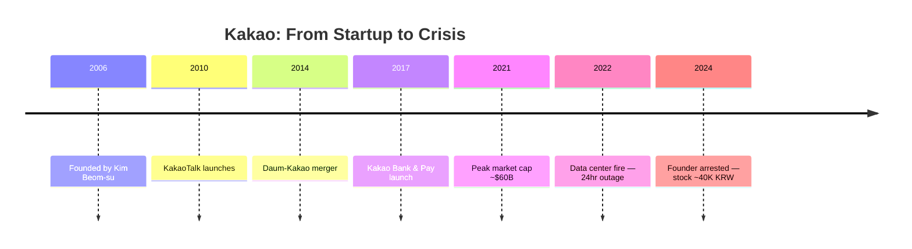

**References**: [Kakao IR](https://ir.kakaocorp.com) | [Yahoo Finance (035720.KS)](https://finance.yahoo.com/quote/035720.KS) | [Wikipedia — Kakao](https://en.wikipedia.org/wiki/Kakao)

---

## Slide 2: The Origin Story — Contrarian Bet on Mobile

### From Portal Wars to the Mobile Frontier (2006–2010)

**The Setup**: In 2007, Kim Beom-su walked away from NHN (now Naver), the company he co-built into Korea's dominant internet portal. While every major Korean tech company was fighting over desktop web portals and search, Kim made a contrarian bet: **mobile would eat everything**.

- **1998**: Kim founded Hangame (online gaming), merged with Naver (2001) to create NHN — Korea's internet giant
- **2007**: Left NHN at the peak of the desktop internet era to start over
- **2010 (March 18)**: Launched **KakaoTalk** — a free mobile messaging app — when smartphones had barely **20% penetration** in Korea
- **Timing was everything**: Korean carriers charged **KRW 30–50 per SMS**; KakaoTalk offered free messaging over data
- **Growth**: 1M users within months; 100M+ globally by 2013
- **Key insight**: Messaging is the most frequent mobile behavior — own the conversation, own the platform

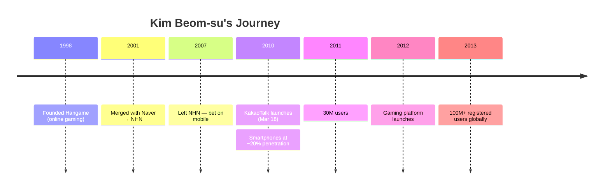

**Innovation Type**: *Product Innovation* — reimagined communication as a mobile-first, free, platform-native experience

**References**: [Wikipedia — KakaoTalk](https://en.wikipedia.org/wiki/KakaoTalk) | [Korea Herald](https://www.koreaherald.com) | [Wikipedia — Kakao](https://en.wikipedia.org/wiki/Kakao)

---

## Slide 3: Platform Explosion — The Super App Strategy

### Building an Ecosystem on Top of Conversations (2012–2017)

**The Playbook**: Once KakaoTalk achieved near-universal adoption, Kakao executed a systematic platform expansion — every new service launched with built-in distribution to 50M+ users.

- **2012 — Gaming Platform**: Launched social games on KakaoTalk; "Anipang" became a national phenomenon. Mobile gaming revenue exploded to hundreds of billions of won
- **2014 — Daum Merger**: Acquired Daum (Korea's #2 web portal) for search, email, and content capabilities
- **2015 — Kakao Taxi (now Kakao T)**: Ride-hailing launched within KakaoTalk; captured **90%+ market share** in app-based taxi hailing
- **2017 — Kakao Bank**: Korea's first internet-only bank. Opened **300,000 accounts in the first 24 hours**. Now serves **23M+ customers**
- **2017 — Kakao Pay**: Mobile payments platform, now with **37M registered users** and KRW 100T+ annual transaction volume

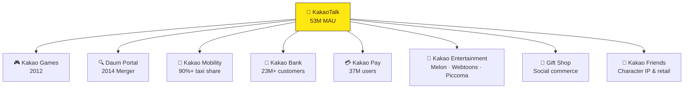

**Innovation Type**: *Operational Innovation* — leveraged the messaging platform as a distribution engine for O2O (Online-to-Offline) services, creating a flywheel of user engagement

**References**: [Kakao IR](https://ir.kakaocorp.com) | [Korea Herald](https://www.koreaherald.com) | [Wikipedia — Kakao](https://en.wikipedia.org/wiki/Kakao)

---

## Slide 4: The Platform Chaebol — Institutional Innovation

### A New Model for Korean Tech Conglomerates (2017–2021)

**The Structure**: Kakao invented the "platform chaebol" — unlike traditional Korean conglomerates (Samsung, Hyundai) built on industrial cross-shareholding, Kakao built a **digital holding company** where each vertical became an independent subsidiary with its own IPO path.

- **100+ subsidiaries and affiliates** spanning fintech, mobility, entertainment, AI, healthcare, blockchain, and enterprise software
- **Subsidiary IPO Strategy**: Monetized growth by taking subsidiaries public individually:
  - Kakao Games IPO (2020, KOSDAQ)
  - Kakao Bank IPO (Aug 2021, raised ~$2.2B — Korea's largest fintech IPO, valued at ~KRW 18T)
  - Kakao Pay IPO (Nov 2021, KOSPI — valued at ~KRW 16T at peak)
- **Peak Market Cap (2021)**: ~KRW 70 trillion (~$60B USD) — briefly surpassed Naver
- **Kakao's stakes**: ~27% in Kakao Bank, ~44% in Kakao Pay, ~57% in Kakao Games
- **Each subsidiary leverages the KakaoTalk user base** while operating with independent management and P&L

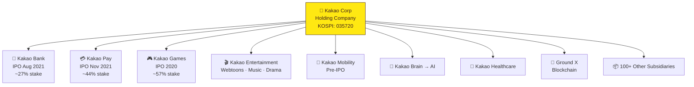

**Innovation Type**: *Institutional Innovation* — created a scalable model for platform-driven conglomerate building, distinct from both Western tech (single-entity) and traditional Korean chaebol models

**References**: [Kakao IR](https://ir.kakaocorp.com) | [Korea Exchange (KRX)](https://www.krx.co.kr) | [Kakao Bank IR](https://www.kakaobank.com/ir)

---

## Slide 5: Revenue Engine — Where the Money Comes From

### Dual-Engine Business Model with Thinning Margins

**Consolidated Financials (KRW)**:

| Metric | 2021 | 2022 | 2023 | 2024 (est.) |
|--------|------|------|------|-------------|
| **Revenue** | 6.1T | 6.5T | 7.1T | 7.5–7.8T |
| **Operating Profit** | 590B | 440B | 370–400B | 350–400B |
| **Net Income** | 950B | 180B | **-390B (loss)** | Recovery expected |
| **Operating Margin** | 9.7% | 6.8% | 5.3% | ~5% |

> **Why the 2023 net loss?** Impairment charges on subsidiary investments (Kakao Entertainment, Kakao Mobility write-downs) and one-time restructuring costs following the 2022 fire and regulatory actions.

**Revenue by Segment (2023)**:

| Segment | Share | Key Drivers |
|---------|-------|-------------|
| **Content** | ~55–60% | Kakao Entertainment (webtoons, music, drama), Kakao Games, Piccoma (Japan) |
| **Platform** | ~40–45% | KakaoTalk advertising, commerce (Gift Shop), Kakao Pay, Kakao Mobility |

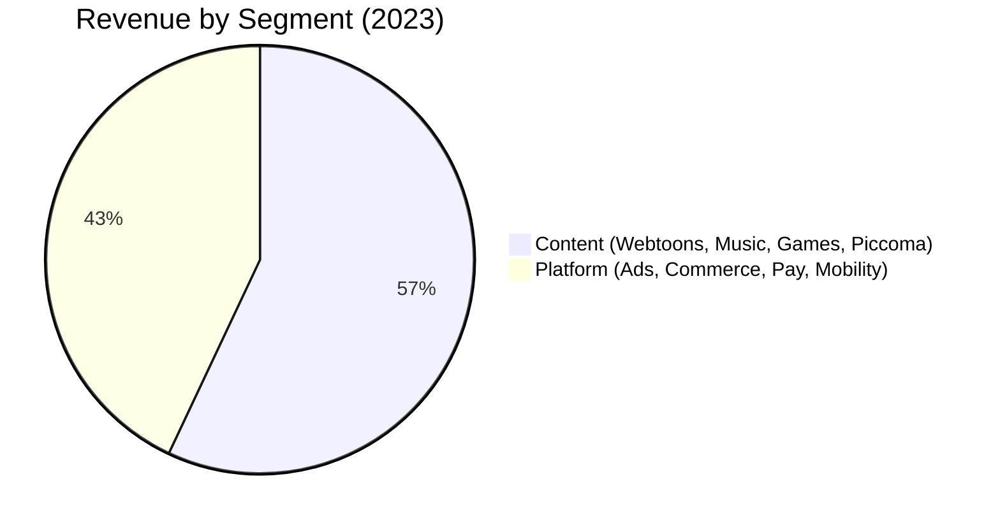

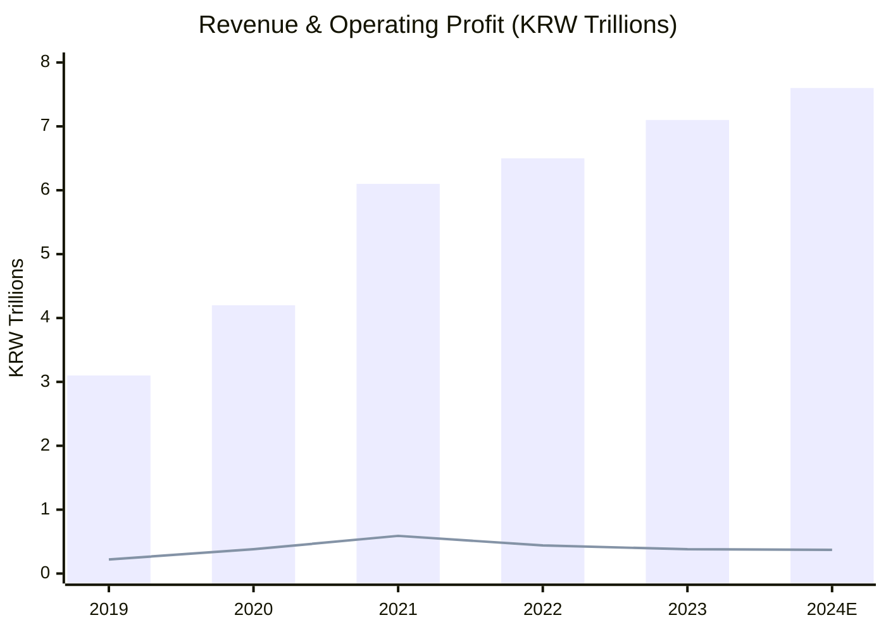

- **Piccoma** (Japan's #1 manga/webtoon app): A breakout global success, pioneering the "wait-or-pay" freemium model for digital comics
- **KakaoTalk Gift Shop**: Created Korea's "gift economy" — buying coffee/snacks for friends via chat became a cultural norm worth billions annually

**References**: [Kakao IR Earnings](https://ir.kakaocorp.com) | [DART (Korean SEC)](https://dart.fss.or.kr) | [Nikkei Asia](https://asia.nikkei.com)

---

## Slide 6: Competitive Moat — Why Kakao Is Hard to Displace

### Network Effects and Ecosystem Lock-In — But Limited Global Scale

**The Core Moat**: KakaoTalk's 97% penetration creates a **social infrastructure monopoly**. You cannot meaningfully participate in Korean digital life without it.

- **Network Effects**: Every Korean uses KakaoTalk because every other Korean uses KakaoTalk. Switching costs are essentially social exclusion
- **Ecosystem Lock-In**: Banking (Kakao Bank) + Payments (Kakao Pay) + Transport (Kakao T) + Entertainment (Melon, webtoons) + Commerce (Gift Shop) — all accessible within one platform
- **Data Advantage**: Cross-service behavioral data on 50M+ users enables superior targeting and personalization
- **Brand Familiarity**: Kakao's "Kakao Friends" characters (Ryan, Apeach, etc.) are a cultural phenomenon — retail stores, merchandise, and licensing revenue

**The Paradox**: Regional champion, global minnow — KakaoTalk dominates South Korea but ranks only **6th-7th globally** with 1.8% of WhatsApp's user base.

---

#### **Global Messenger App Rankings by MAU (2024-2025)**

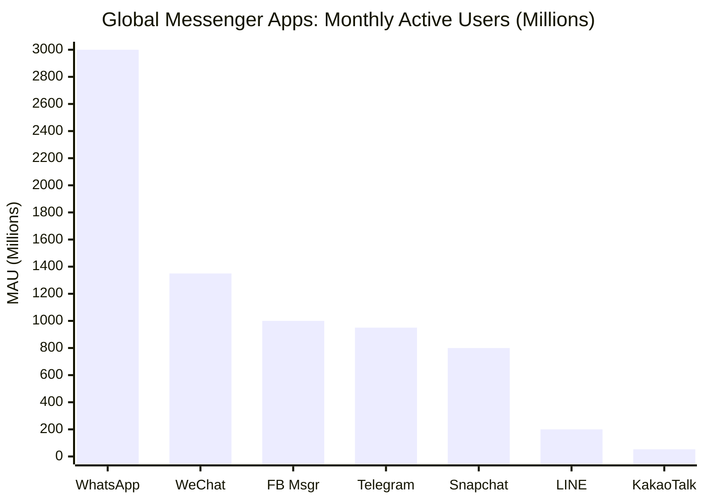

| Rank | App | MAU | Primary Market | YoY Growth |
|------|-----|-----|---------------|------------|
| 1 | **WhatsApp** | ~3.0B | Global (exc. China, S. Korea, Japan) | +5-8% |
| 2 | **WeChat** | ~1.35B | China | +3-5% |
| 3 | **Facebook Messenger** | ~1.0B | Global | Flat to -2% |
| 4 | **Telegram** | ~950M | Global (strong in Russia, MENA) | +15-20% |
| 5 | **Snapchat** | ~800M | US, Europe | +5-8% |
| 6 | **LINE** | ~200M | Japan, Taiwan, Thailand | +1-3% |
| 7 | **KakaoTalk** | ~53M | **South Korea (95% penetration)** | +1-2% |

**Key Insight**: KakaoTalk's 53M MAU represents just **1.8% of WhatsApp's scale**. This 56x user gap creates strategic vulnerability despite regional dominance.

---

#### **South Korea App Store Rankings (Communication Category, 2024-2025)**

**Google Play Store — South Korea**:
1. **🥇 KakaoTalk** (#1 — 95% market share)
2. Telegram (#2 — ~3% share)
3. WhatsApp (#3 — <1% share)
4. Discord (#4)
5. LINE (#5)
6. Signal (#6)

**Apple App Store — South Korea**:
1. **🥇 KakaoTalk** (#1 — 95% market share)
2. Telegram (#2)
3. WhatsApp (#3)
4. Discord (#4)

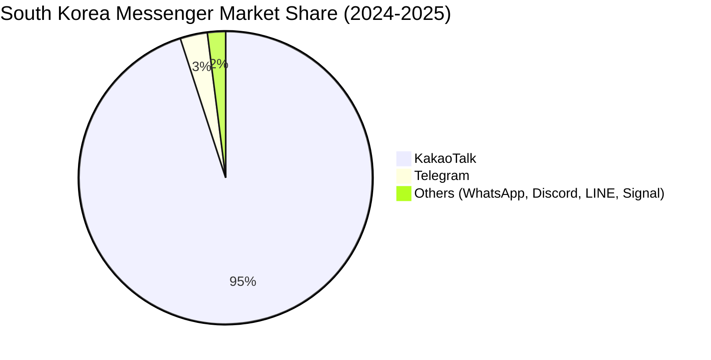

---

#### **Regional Champions: The Platform Monopoly Club**

KakaoTalk belongs to an elite group of **regional messaging monopolies** that successfully resisted WhatsApp's global dominance:

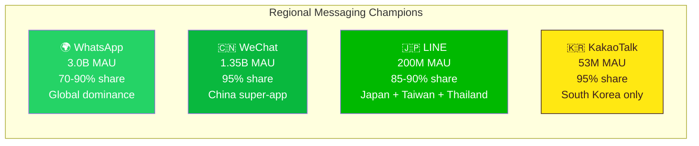

| Regional Champion | Country | MAU | Market Share | Super-App Features | Export Success |
|------------------|---------|-----|--------------|-------------------|----------------|
| **WhatsApp** | Global | 3.0B | 70-90% (most countries) | Payments (limited) | ✅ Dominant globally |
| **WeChat** | China | 1.35B | ~95% | Full super-app | ❌ Minimal outside China |
| **LINE** | Japan/Taiwan/Thailand | 200M | 85-90% (3 countries) | Payments, banking, content | ⚠️ Regional only |
| **KakaoTalk** | South Korea | 53M | ~95% | Full super-app | ❌ No international traction |

**Strategic Implication**: KakaoTalk and LINE prove that **regional monopolies can withstand global giants** — but only within their home markets. Neither has successfully exported their platform.

---

#### **Kakao vs Naver — Korean Tech Rivalry (2023)**

| Metric | Kakao | Naver |
|--------|-------|-------|
| **Market Cap** | ~19–21T KRW | ~32–38T KRW |
| **Revenue** | 7.1T KRW | 9.7T KRW |
| **Operating Profit** | 370–400B KRW | 1.6T KRW |
| **Operating Margin** | ~5% | ~16% |
| **Core Strength** | Messaging, mobility, fintech | Search, commerce, webtoons |
| **Global Asset** | Piccoma (Japan) | LINE (Japan), Webtoon (global) |

**Winner**: Naver has better profitability (16% vs 5% margin) and global reach (LINE's 200M MAU dwarfs KakaoTalk's international presence).

---

#### **Competitive Positioning: Korea vs Global**

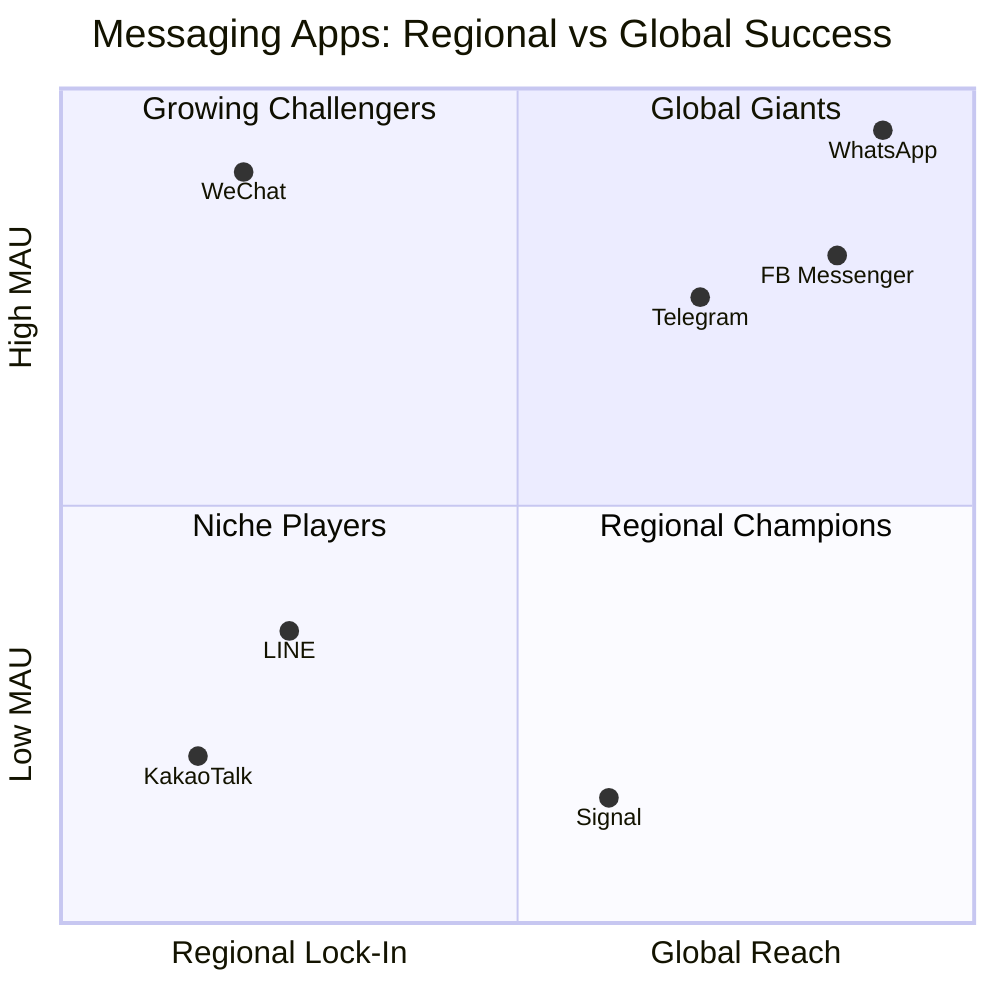

---

#### **Local Competitive Threats**

| Competitor | Arena | Kakao's Position |
|-----------|-------|-----------------|
| **Naver** | Search, payments, webtoons | Naver dominates search; Kakao dominates messaging and mobility |
| **Toss** | Fintech, banking | Rising challenger to Kakao Pay/Bank with strong UX |
| **Coupang** | E-commerce | "Amazon of Korea" — Kakao competes via gift commerce, not direct retail |
| **Samsung Pay** | Mobile payments | Hardware-integrated but lacks Kakao's social distribution |
| **Telegram** | Messaging | Growing in Korea (3% share) among privacy-conscious users |
| **Global Big Tech** | AI, cloud, content | ChatGPT, Netflix, AWS threaten specific verticals |

**The Scale Vulnerability**: While KakaoTalk is unassailable in South Korea, global competitors have **50-60x more users**, enabling R&D budgets, AI capabilities, and network effects that dwarf Kakao's resources.

**References**: [Kakao IR](https://ir.kakaocorp.com) | [Naver IR](https://www.navercorp.com/en/ir) | [Business of Apps](https://www.businessofapps.com) | [Statista](https://www.statista.com) | [Yahoo Finance](https://finance.yahoo.com/quote/035720.KS)

---

## Slide 7: The Cracks — Three Disruptions That Shook Kakao

### When Infrastructure Fails, Monopoly Becomes Liability (2022–2024)

**Disruption 1: The Data Center Fire (October 15, 2022)**
- Fire at SK C&C's Pangyo data center took down **all Kakao services for ~24 hours**
- 53 million users lost access to messaging, payments, banking, taxi-hailing, and navigation simultaneously
- **Stock impact**: Dropped from ~KRW 58,000 to ~KRW 45,000 in the following weeks (~22% decline)
- **Financial cost**: KRW 300B+ ($230M) pledged for infrastructure redundancy
- CEO Nam Koong-hoon resigned; government launched inquiries into platform concentration risk

**Disruption 2: Regulatory Crackdown (2023–2024)**
- Korea Fair Trade Commission investigated Kakao Mobility for monopolistic practices
- Allegations of self-preferencing and unfair bundling across the Kakao ecosystem
- Platform Anti-Monopoly legislation targeting dominant digital platforms
- Financial regulators increased scrutiny of Kakao Bank and Kakao Pay

**Disruption 3: Founder's Arrest (July 2024)**
- Kim Beom-su arrested on stock manipulation charges related to the SM Entertainment acquisition bidding war against HYBE
- Allegations: Directed Kakao affiliates to artificially inflate SM Entertainment share prices
- **Stock at arrest**: ~KRW 42,000 — down ~75% from the 2021 peak of ~KRW 173,000
- **Total market cap destruction**: From ~KRW 70T ($60B) to ~KRW 19–21T ($15B)

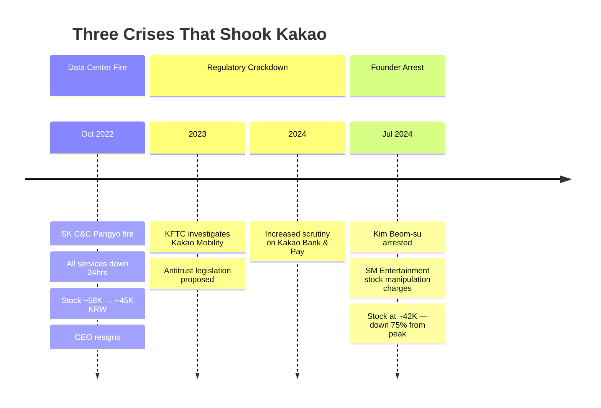

**References**: [Korea Herald](https://www.koreaherald.com) | [Yonhap News](https://en.yna.co.kr) | [Yahoo Finance (035720.KS)](https://finance.yahoo.com/quote/035720.KS)

---

## Slide 8: The Innovation Paradox — Success Breeds Vulnerability

### How Kakao's Strengths Became Weaknesses

| Strength | How It Became a Vulnerability |
|----------|------------------------------|
| **97% penetration** | Made Kakao "too big to ignore" for regulators — became a political target |
| **Platform monopoly** | Single point of failure exposed by data center fire; regulatory antitrust scrutiny |
| **Subsidiary expansion** | 100+ entities created governance complexity; enabled the SM Entertainment scandal |
| **Founder-centric culture** | Kim Beom-su's arrest created leadership vacuum and strategic uncertainty |
| **Ecosystem lock-in** | Users have no alternative, but this also generates resentment and regulatory attention |
| **Aggressive M&A** | SM Entertainment bidding war led to criminal charges and shareholder value destruction |

**Stock Price Journey (post 5:1 split, April 2021)**:

| Period | Price (KRW) | Event |
|--------|-------------|-------|
| Mid-2021 (peak) | ~173,000 | Peak market cap ~KRW 70T |
| Oct 2022 | ~58,000 → 45,000 | Data center fire |
| Mid-2024 | ~42,000 | Founder arrest |
| Early 2025 | ~38,000–48,000 | Uncertain recovery |
| 52-week range | ~37,000–55,000 | — |

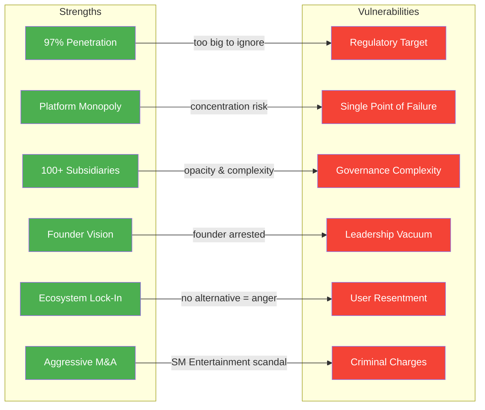

**The Lesson**: In platform economics, the same network effects that create monopoly power also create **concentration risk** — operational (infrastructure), regulatory (antitrust), and reputational (too-big-to-fail expectations).

**The Scale Paradox**: Regional dominance vs global vulnerability

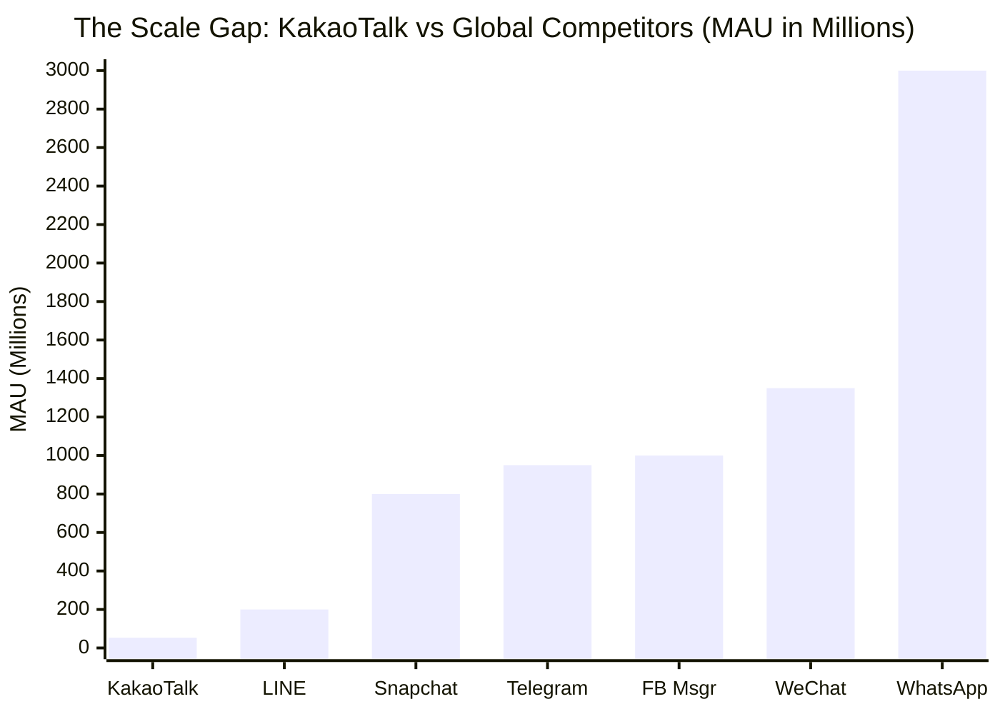

> **The Strategic Vulnerability**: KakaoTalk has **1.8% of WhatsApp's user base**. Global competitors operate at 20-60x scale, enabling vastly superior R&D budgets, AI capabilities, and data advantages. Regional monopoly ≠ protection from disruption.

**References**: [Yahoo Finance (035720.KS)](https://finance.yahoo.com/quote/035720.KS) | [Korea Herald](https://www.koreaherald.com) | [Kakao IR](https://ir.kakaocorp.com) | [Business of Apps](https://www.businessofapps.com)

---

## Slide 9: Strategic Recommendations — Preparing for Disruptions

### What Kakao Must Do to Secure Its Future

**1. Infrastructure Resilience**
- Multi-cloud, multi-region architecture — eliminate single points of failure
- Real-time failover systems for critical services (messaging, payments, mobility)
- Kakao has announced **KRW 1T+ investment** in IT infrastructure through 2025
- Public transparency reporting on uptime and infrastructure investment

**2. Proactive Regulatory Engagement**
- Voluntary adoption of platform fairness standards before legislation forces them
- Open API access for competitors in mobility, payments, and commerce
- Establish an independent platform governance board to pre-empt regulatory intervention

**3. AI-First Transformation**
- Develop Korean-language AI models (building on Kakao Brain → Kakao AI legacy)
- Integrate generative AI across KakaoTalk — conversational commerce, AI assistants, content creation
- Partnership strategy: Announced collaborations with **Google Cloud** and **OpenAI** for AI integration
- Cultural/linguistic advantage: Korean-specific AI that global competitors cannot easily replicate

**4. Governance Reform**
- Transition from founder-dependent to professional management with clear succession planning
- Simplify subsidiary structure — divest non-core assets, reduce 100+ entity count
- Strengthen board independence and shareholder rights
- Post-arrest governance reforms already underway (new independent directors appointed)

**5. Selective Globalization**
- Double down on proven global winners: Piccoma (Japan/France), webtoon IP licensing, K-content
- Monetize Korean cultural exports (webtoons to screen adaptations, K-pop via SM Entertainment)
- Abandon attempts to export KakaoTalk as a messaging platform (WhatsApp/WeChat network effects are unassailable)

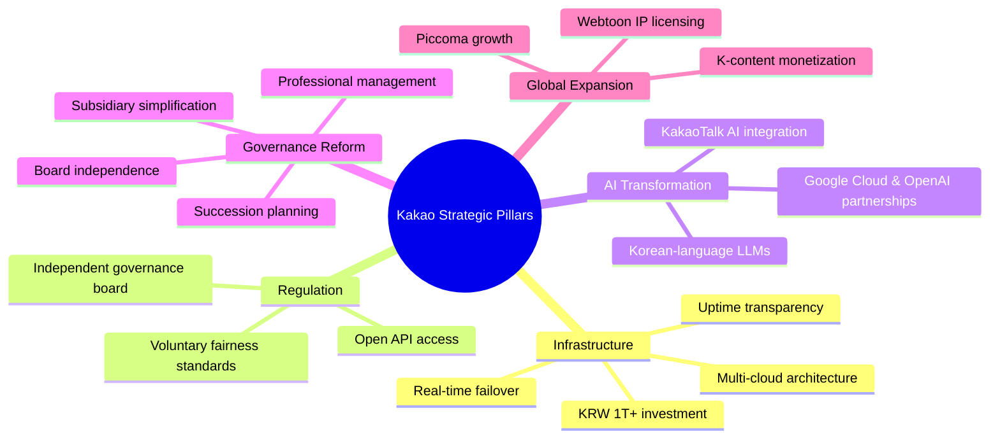

**References**: [Kakao IR](https://ir.kakaocorp.com) | [Korea Herald](https://www.koreaherald.com) | [Nikkei Asia](https://asia.nikkei.com)

---

## Slide 10: Conclusion — The Future of Korea's Platform Economy

### Kakao at a Crossroads: Retrenchment or Reinvention?

**The Bull Case**:
- KakaoTalk's 97% penetration is an **irreplaceable asset** — no competitor can replicate this social graph
- Piccoma and webtoon IP represent a **genuine global growth engine**
- AI integration into the super app could unlock the next wave of monetization
- Governance reform and regulatory compliance could restore investor confidence
- At ~KRW 40,000–48,000, stock trades at historically low multiples — recovery upside is significant

**The Bear Case**:
- Global AI players (OpenAI, Google) could commoditize Kakao's platform intelligence
- Toss and other fintech challengers are eroding Kakao's financial services moat
- Regulatory burden may permanently reduce margins (operating margin already at ~5% vs Naver's ~16%)
- Leadership uncertainty post-Kim Beom-su could lead to strategic drift
- Net loss in 2023 (-390B KRW) signals structural profitability challenges

**The Central Question for Kakao**:
> *Can a company that became indispensable by moving fast and breaking norms now thrive in an era that demands governance, restraint, and global competition?*

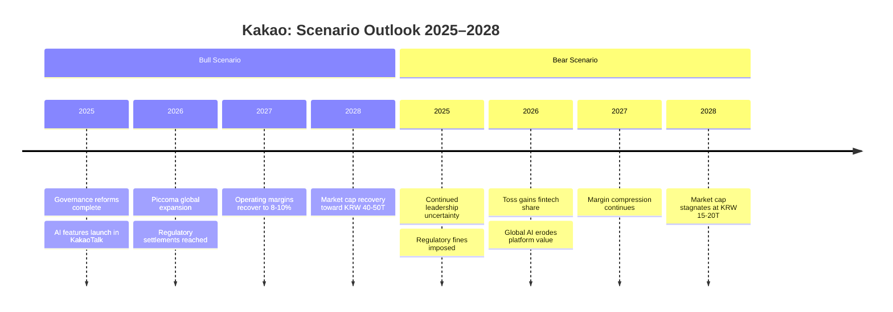

**Key Takeaway**: Kakao's story is a masterclass in **platform-driven innovation** — but also a cautionary tale about how monopoly power, unchecked expansion, and concentration risk can turn an unassailable position into a vulnerable one. The next chapter depends on whether Kakao can innovate its **institutions and governance** as effectively as it once innovated its **products and operations**.

**References**: [Kakao IR](https://ir.kakaocorp.com) | [Yahoo Finance (035720.KS)](https://finance.yahoo.com/quote/035720.KS) | [Korea Herald](https://www.koreaherald.com)

---

## Appendix: Key Data Points Quick Reference

**Company Snapshot**:

| Metric | Value |
|--------|-------|
| KakaoTalk MAU | ~53 million (97%+ Korean penetration) |
| Revenue (2023) | KRW 7.1T (~$5.4B) |
| Operating Profit (2023) | KRW 370–400B |
| Net Income (2023) | KRW -390B (loss) |
| Operating Margin (2023) | ~5.3% |
| Revenue (2024 est.) | KRW 7.5–7.8T |
| Peak Market Cap (2021) | ~KRW 70T (~$60B) |
| Current Market Cap (2024–25) | ~KRW 19–21T (~$15B) |
| Kakao Bank Customers | 23M+ |
| Kakao Pay Users | 37M+ |
| Kakao Mobility Market Share | 90%+ (app-based taxi) |
| Subsidiaries | 100+ |
| Piccoma (Japan) | #1 manga/webtoon platform |
| Revenue CAGR (2019–2023) | ~23% |
| Stock Decline from Peak | ~75% |

**Kakao vs Naver (2023 Comparison)**:

| Metric | Kakao | Naver |
|--------|-------|-------|
| Market Cap | ~19–21T KRW | ~32–38T KRW |
| Revenue | 7.1T KRW | 9.7T KRW |
| Operating Profit | 370–400B KRW | 1.6T KRW |
| Operating Margin | ~5% | ~16% |
| Core Strength | Messaging, mobility, fintech | Search, commerce, webtoons |
| Global Asset | Piccoma (Japan) | LINE (Japan), Webtoon (global) |

**Consolidated Financial Summary (KRW)**:

| Metric | 2019 | 2020 | 2021 | 2022 | 2023 | 2024E |
|--------|------|------|------|------|------|-------|
| Revenue | 3.1T | 4.2T | 6.1T | 6.5T | 7.1T | 7.5–7.8T |
| Op. Profit | 220B | 380B | 590B | 440B | 370–400B | 350–400B |
| Net Income | 200B | 440B | 950B | 180B | -390B | Recovery |
| Op. Margin | 7.1% | 9.0% | 9.7% | 6.8% | 5.3% | ~5% |

**Stock Price History (post 5:1 split, April 2021)**:

| Date/Period | Price (KRW) | Context |
|-------------|-------------|---------|
| Mid-2021 | ~173,000 | All-time high; subsidiary IPO euphoria |
| Oct 2022 | ~58,000 → 45,000 | Data center fire |
| Mid-2024 | ~42,000 | Founder arrest |
| Early 2025 | ~38,000–48,000 | Uncertain recovery |
| 52-week range | ~37,000–55,000 | — |

**Global Messenger App Comparison (2024-2025)**:

| App | MAU | Primary Markets | Market Share | Growth Rate | Super-App? |
|-----|-----|----------------|--------------|-------------|-----------|
| **WhatsApp** | ~3.0B | Global (exc. China, S. Korea, Japan) | 70-90% (most countries) | +5-8% YoY | Limited |
| **WeChat** | ~1.35B | China | ~95% (China) | +3-5% YoY | ✅ Full |
| **FB Messenger** | ~1.0B | Global | Declining share | Flat to -2% | No |
| **Telegram** | ~950M | Global, strong in Russia/MENA | 10-20% (Europe) | +15-20% YoY | Moderate |
| **Snapchat** | ~800M | US, Europe, young demographics | 20-30% (US youth) | +5-8% YoY | No |
| **LINE** | ~200M | Japan (85%), Taiwan (90%), Thailand (85%) | Regional dominance | +1-3% YoY | ✅ Full |
| **KakaoTalk** | ~53M | **South Korea (95%)** | Regional monopoly | +1-2% YoY | ✅ Full |
| **Viber** | ~280M | Eastern Europe, MENA | 10-30% (select countries) | Flat | No |
| **Signal** | ~100M | Global, privacy-focused | <5% (most countries) | +15% YoY | No |

**KakaoTalk's Ranking**: #6-7 globally by MAU, but **#1 in South Korea** with 95% penetration. Only 1.8% of WhatsApp's scale.

**Regional Champions vs Global Giants**:
- **WhatsApp**: Dominant everywhere except China, South Korea, Japan
- **WeChat (China)**, **LINE (Japan)**, **KakaoTalk (South Korea)**: Regional monopolies with full super-app features but minimal international presence
- **Telegram**: Fast-growing global challenger, especially in privacy-conscious markets

---

*Sources: [Kakao Corp IR](https://ir.kakaocorp.com), [DART (Korean SEC)](https://dart.fss.or.kr), [Yahoo Finance (035720.KS)](https://finance.yahoo.com/quote/035720.KS), [Korea Exchange](https://www.krx.co.kr), [Korea Herald](https://www.koreaherald.com), [Yonhap News](https://en.yna.co.kr), [Nikkei Asia](https://asia.nikkei.com), [Wikipedia — Kakao](https://en.wikipedia.org/wiki/Kakao), [Business of Apps](https://www.businessofapps.com), [Statista](https://www.statista.com). Financial figures are approximate and based on public reporting through early 2025.*
